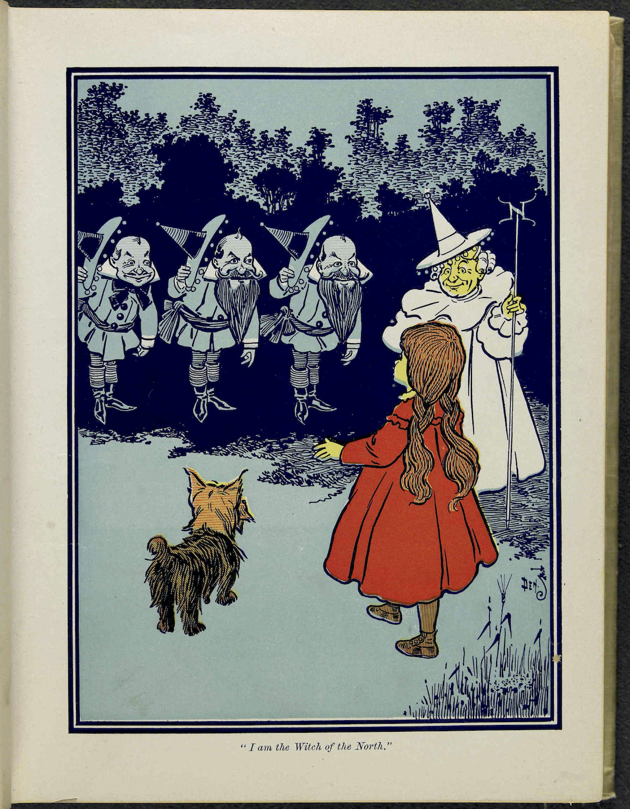

# {{title}}

## {{subtitle}}

She was awakened by a shock, so sudden and severe that if Dorothy had not been lying on the soft bed she might have been hurt. As it was, the jar made her catch her breath and wonder what had happened; and Toto put his cold little nose into her face and whined dismally. Dorothy sat up and noticed that the house was not moving; nor was it dark, for the bright sunshine came in at the window, flooding the little room. She sprang from her bed and with Toto at her heels ran and opened the door.

The little girl gave a cry of amazement and looked about her, her eyes growing bigger and bigger at the wonderful sights she saw.

The cyclone had set the house down very gently—for a cyclone—in the midst of a country of marvelous beauty. There were lovely patches of greensward all about, with stately trees bearing rich and luscious fruits. Banks of gorgeous flowers were on every hand, and birds with rare and brilliant plumage sang and fluttered in the trees and bushes. A little way off was a small brook, rushing and sparkling along between green banks, and murmuring in a voice very grateful to a little girl who had lived so long on the dry, gray prairies.

While she stood looking eagerly at the strange and beautiful sights, she noticed coming toward her a group of the queerest people she had ever seen. They were not as big as the grown folk she had always been used to; but neither were they very small. In fact, they seemed about as tall as Dorothy, who was a well-grown child for her age, although they were, so far as looks go, many years older.

Three were men and one a woman, and all were oddly dressed. They wore round hats that rose to a small point a foot above their heads, with little bells around the brims that tinkled sweetly as they moved. The hats of the men were blue; the little woman’s hat was white, and she wore a white gown that hung in pleats from her shoulders. Over it were sprinkled little stars that glistened in the sun like diamonds. The men were dressed in blue, of the same shade as their hats, and wore well-polished boots with a deep roll of blue at the tops. The men, Dorothy thought, were about as old as Uncle Henry, for two of them had beards. But the little woman was doubtless much older. Her face was covered with wrinkles, her hair was nearly white, and she walked rather stiffly.

When these people drew near the house where Dorothy was standing in the doorway, they paused and whispered among themselves, as if afraid to come farther. But the little old woman walked up to Dorothy, made a low bow and said, in a sweet voice:

“You are welcome, most noble Sorceress, to the land of the Munchkins. We are so grateful to you for having killed the Wicked Witch of the East, and for setting our people free from bondage.”

Dorothy listened to this speech with wonder. What could the little woman possibly mean by calling her a sorceress, and saying she had killed the Wicked Witch of the East? Dorothy was an innocent, harmless little girl, who had been carried by a cyclone many miles from home; and she had never killed anything in all her life.

But the little woman evidently expected her to answer; so Dorothy said, with hesitation, “You are very kind, but there must be some mistake. I have not killed anything.”

“Your house did, anyway,” replied the little old woman, with a laugh, “and that is the same thing. See!” she continued, pointing to the corner of the house. “There are her two feet, still sticking out from under a block of wood.”

Dorothy looked, and gave a little cry of fright. There, indeed, just under the corner of the great beam the house rested on, two feet were sticking out, shod in silver shoes with pointed toes.

“Oh, dear! Oh, dear!” cried Dorothy, clasping her hands together in dismay. “The house must have fallen on her. Whatever shall we do?”

“There is nothing to be done,” said the little woman calmly.

“But who was she?” asked Dorothy.

“She was the Wicked Witch of the East, as I said,” answered the little woman. “She has held all the Munchkins in bondage for many years, making them slave for her night and day. Now they are all set free, and are grateful to you for the favor.”

“Who are the Munchkins?” inquired Dorothy.

“They are the people who live in this land of the East where the Wicked Witch ruled.”

“Are you a Munchkin?” asked Dorothy.

“No, but I am their friend, although I live in the land of the North. When they saw the Witch of the East was dead the Munchkins sent a swift messenger to me, and I came at once. I am the Witch of the North.”

“Oh, gracious!” cried Dorothy. “Are you a real witch?”

“Yes, indeed,” answered the little woman. “But I am a good witch, and the people love me. I am not as powerful as the Wicked Witch was who ruled here, or I should have set the people free myself.”

“But I thought all witches were wicked,” said the girl, who was half frightened at facing a real witch. “Oh, no, that is a great mistake. There were only four witches in all the Land of Oz, and two of them, those who live in the North and the South, are good witches. I know this is true, for I am one of them myself, and cannot be mistaken. Those who dwelt in the East and the West were, indeed, wicked witches; but now that you have killed one of them, there is but one Wicked Witch in all the Land of Oz—the one who lives in the West.”

“But,” said Dorothy, after a moment’s thought, “Aunt Em has told me that the witches were all dead—years and years ago.”

“Who is Aunt Em?” inquired the little old woman.

“She is my aunt who lives in Kansas, where I came from.”

The Witch of the North seemed to think for a time, with her head bowed and her eyes upon the ground. Then she looked up and said, “I do not know where Kansas is, for I have never heard that country mentioned before. But tell me, is it a civilized country?”

“Oh, yes,” replied Dorothy.

“Then that accounts for it. In the civilized countries I believe there are no witches left, nor wizards, nor sorceresses, nor magicians. But, you see, the Land of Oz has never been civilized, for we are cut off from all the rest of the world. Therefore we still have witches and wizards amongst us.”

“Who are the wizards?” asked Dorothy.

“Oz himself is the Great Wizard,” answered the Witch, sinking her voice to a whisper. “He is more powerful than all the rest of us together. He lives in the City of Emeralds.”

Dorothy was going to ask another question, but just then the Munchkins, who had been standing silently by, gave a loud shout and pointed to the corner of the house where the Wicked Witch had been lying.

“What is it?” asked the little old woman, and looked, and began to laugh. The feet of the dead Witch had disappeared entirely, and nothing was left but the silver shoes.

“She was so old,” explained the Witch of the North, “that she dried up quickly in the sun. That is the end of her. But the silver shoes are yours, and you shall have them to wear.” She reached down and picked up the shoes, and after shaking the dust out of them handed them to Dorothy.

“The Witch of the East was proud of those silver shoes,” said one of the Munchkins, “and there is some charm connected with them; but what it is we never knew.”

Dorothy carried the shoes into the house and placed them on the table. Then she came out again to the Munchkins and said:

“I am anxious to get back to my aunt and uncle, for I am sure they will worry about me. Can you help me find my way?”

The Munchkins and the Witch first looked at one another, and then at Dorothy, and then shook their heads.

“At the East, not far from here,” said one, “there is a great desert, and none could live to cross it.”

“It is the same at the South,” said another, “for I have been there and seen it. The South is the country of the Quadlings.”

“I am told,” said the third man, “that it is the same at the West. And that country, where the Winkies live, is ruled by the Wicked Witch of the West, who would make you her slave if you passed her way.”

“The North is my home,” said the old lady, “and at its edge is the same great desert that surrounds this Land of Oz. I’m afraid, my dear, you will have to live with us.”

Dorothy began to sob at this, for she felt lonely among all these strange people. Her tears seemed to grieve the kind-hearted Munchkins, for they immediately took out their handkerchiefs and began to weep also. As for the little old woman, she took off her cap and balanced the point on the end of her nose, while she counted “One, two, three” in a solemn voice. At once the cap changed to a slate, on which was written in big, white chalk marks:

“LET DOROTHY GO TO THE CITY OF EMERALDS”

The little old woman took the slate from her nose, and having read the words on it, asked, “Is your name Dorothy, my dear?”

“Yes,” answered the child, looking up and drying her tears.

“Then you must go to the City of Emeralds. Perhaps Oz will help you.”

“Where is this city?” asked Dorothy.

“It is exactly in the center of the country, and is ruled by Oz, the Great Wizard I told you of.”

“Is he a good man?” inquired the girl anxiously.

“He is a good Wizard. Whether he is a man or not I cannot tell, for I have never seen him.”

“How can I get there?” asked Dorothy.

“You must walk. It is a long journey, through a country that is sometimes pleasant and sometimes dark and terrible. However, I will use all the magic arts I know of to keep you from harm.”

“Won’t you go with me?” pleaded the girl, who had begun to look upon the little old woman as her only friend.

“No, I cannot do that,” she replied, “but I will give you my kiss, and no one will dare injure a person who has been kissed by the Witch of the North.”

She came close to Dorothy and kissed her gently on the forehead. Where her lips touched the girl they left a round, shining mark, as Dorothy found out soon after.

“The road to the City of Emeralds is paved with yellow brick,” said the Witch, “so you cannot miss it. When you get to Oz do not be afraid of him, but tell your story and ask him to help you. Good-bye, my dear.”

The three Munchkins bowed low to her and wished her a pleasant journey, after which they walked away through the trees. The Witch gave Dorothy a friendly little nod, whirled around on her left heel three times, and straightway disappeared, much to the surprise of little Toto, who barked after her loudly enough when she had gone, because he had been afraid even to growl while she stood by.

But Dorothy, knowing her to be a witch, had expected her to disappear in just that way, and was not surprised in the least.
